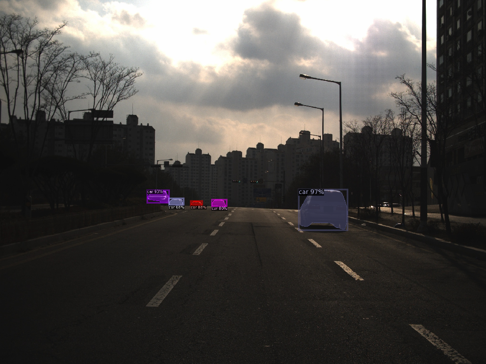

# Detectron2

Detectron2 설치 및 데모 실행하기 ([detectron2](https://github.com/facebookresearch/detectron2))

작성자 : 진대종 ([github](https://github.com/jdj2261))

> Environment
>
> - Ubuntu Version : 18.04
> - CUDA Version : 10.1
> - cuDNN Version :  8.0.4

### 1. 가상환경 생성 및 활성화

해당 가상환경이 활성화되어 있어야 함.

필자의 경우 

~~~
$ conda create --name detectron2
$ source detectron2/bin/activate
$ conda activate detectron2
$ conda install -c menpo opencv
$ conda install pytorch torchvision torchaudio cudatoolkit=10.1 -c pytorch tqdm
~~~

### 2. pytorch 설치하기

필자의 경우 CUDA 10.1, anaconda 환경에서 돌려볼 것이기 때문에, 아래 그림과 같이 선택하여 명령어를 입력함.

[pytorch 다운로드](https://pytorch.org/get-started/locally/)

~~~
$ Python 3.9 users will need to add '-c=conda-forge' for installation
conda install pytorch torchvision torchaudio cudatoolkit=10.1 -c pytorch
~~~

### 3. git 복제하기

~~~
$ git clone https://github.com/facebookresearch/detectron2.git
$ conda -m pip install -e detectron2
~~~

### 4. Demo 실행하기

demo 디렉토리로 들어가 실행 (Object Detect 쪽은 많이 느림..)

원하는 weight model([coco-dataset](https://github.com/facebookresearch/detectron2/blob/v0.1/MODEL_ZOO.md))을 다운로드 한다. 

~~~
$ cd detectron2/demo
~~~

- Image

  option : --input $(이미지 경로)

  ~~~
  $ python demo.py --config-file ../configs/COCO-InstanceSegmentation/mask_rcnn_R_50_FPN_3x.yaml --input ~/Test/merge/images/test_000322.jpg  --opts MODEL.WEIGHTS ../model/model_final_f10217.pkl
  ~~~

  

- Video

  option : --video-input $(video path)

  ~~~
  $ python demo.py --config-file ../configs/COCO-InstanceSegmentation/mask_rcnn_R_50_FPN_3x.yaml --video-input ~/Video/test.mp4  --opts MODEL.WEIGHTS ../model/model_final_f10217.pkl
  ~~~

- webcam

  option : --webcam

  ~~~
  $ python demo.py --config-file ../configs/COCO-InstanceSegmentation/mask_rcnn_R_50_FPN_3x.yaml --webcam --opts MODEL.WEIGHTS ../model/model_final_f10217.pkl
  ~~~

  

  

  